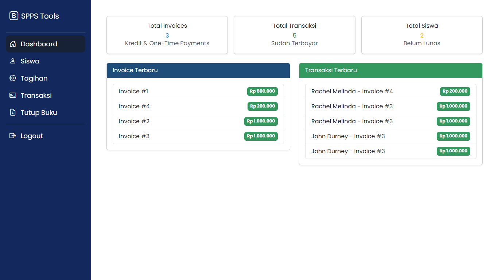
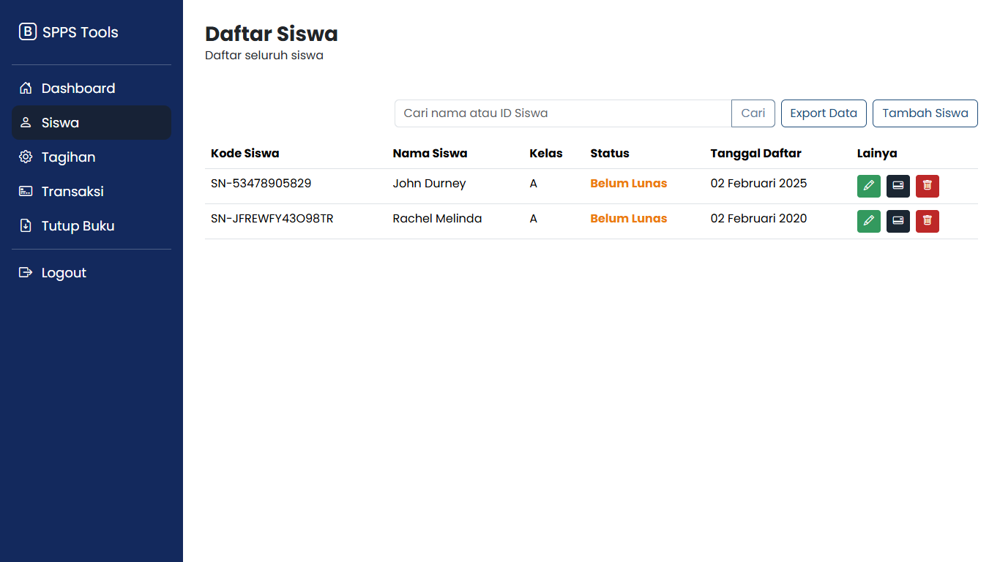
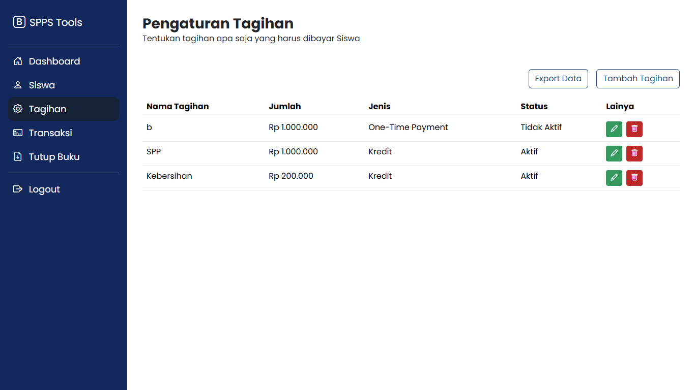
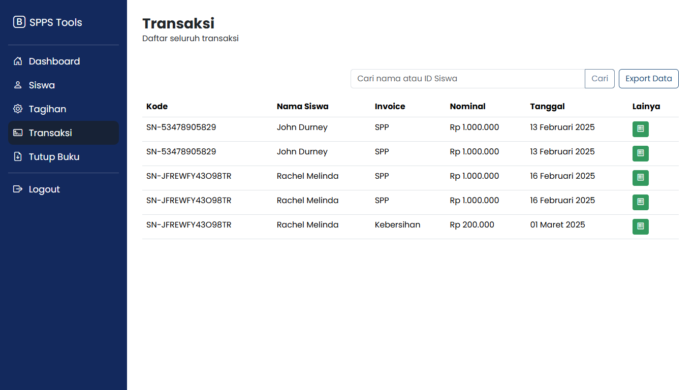
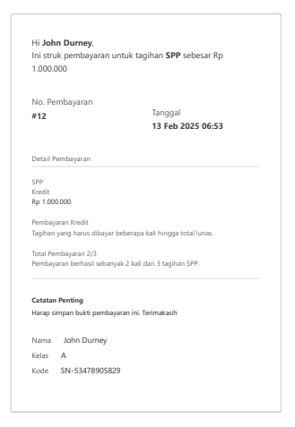

<p align="center"><a href="https://laravel.com" target="_blank"></a></p>

## Pencatat Keuangan

Aplikasi mencatat tagihan siswa secara dinamis, build in with laravel. Menu yang ada pada project ini:

- Dashboard menu
- CRUD data. Baik data siswa, transaksi hingga tagihan
- Support pembayaran kredit (manual)
- Support pembayaran one-time payment (manual)
- Menu dan export laporan tutup buku
- Print invoice
- Filtering data


## Preview Project
Menu Dashboard :


Manajemen Data Siswa :


Manajemen Tagihan :


Manajemen Transaksi :


Printing Invoice : <br>


## Catatan Developer

Jalankan project denngan run command dibawah ini secara berurutan.

```
composer update
```

Buka file .env dan edit bagian ini:
```
DB_DATABASE=masukan_nama_db
DB_USERNAME=masukan_username
DB_PASSWORD=masukan_password
```

Kemudian jalankan proses initialisasi database
```
php artisan migrate
```

autoload files
```
composer dump-autoload
```

Jalankan project nya
```
php artisan serve
```

dan akses website local secara otomatis melalui [http://127.0.0.1:8000/](http://127.0.0.1:8000/)


## Fitur Export Excel

Contoh cara implementasi dan penggunaan.

```
composer require maatwebsite/excel
```
```
php artisan make:export StudentsExport --model=Student
```
Lalu edit file app/Exports/StudentsExport.php


## License

This project is licensed under the Apache License 2.0.
© 2025 SasmitaDn. <br><br>
You are free to use, modify, and distribute this project under the terms of the License.
No warranties or guarantees are provided.